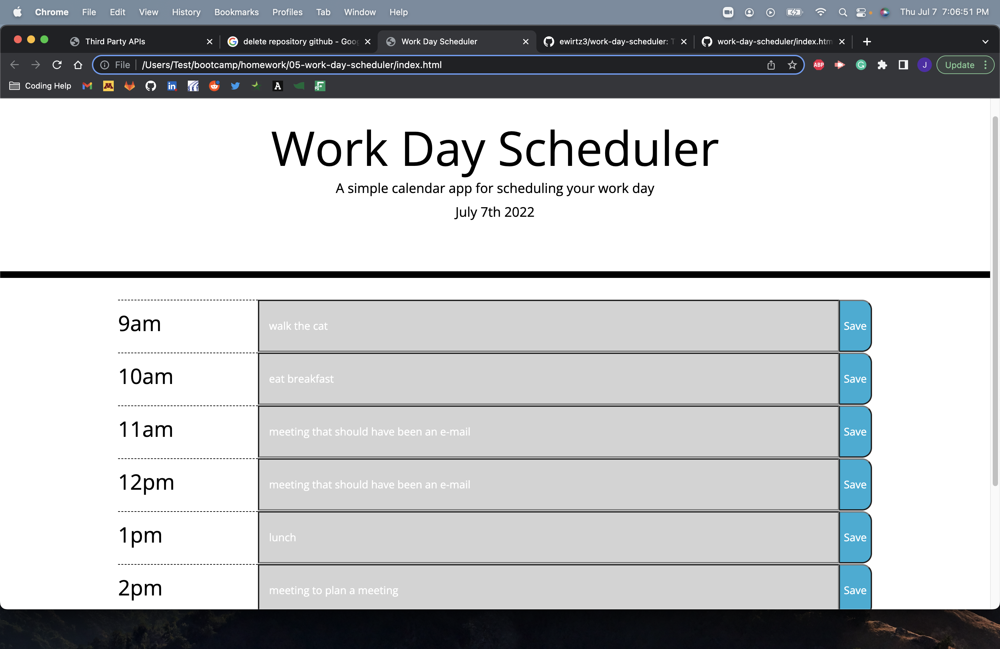
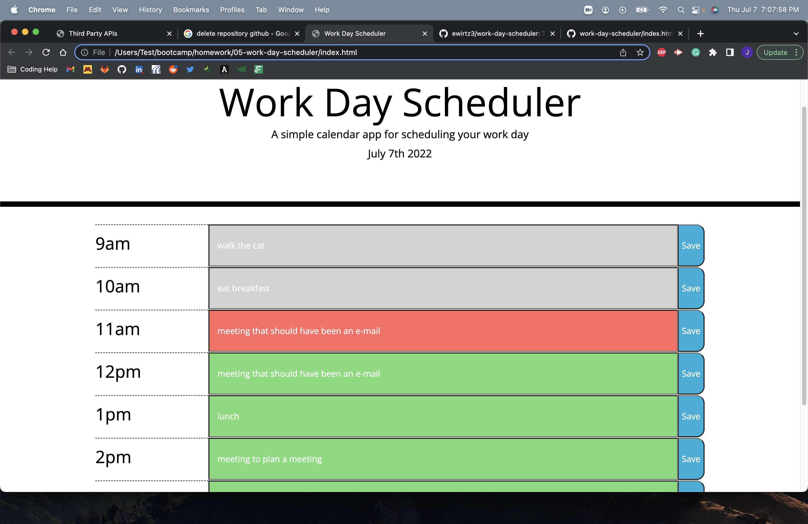

# work-day-scheduler

In this challenge we were to make a work day scheduler

The current date is displayed in the header

the time blocks are color coded based on when they happen, grey for past, red for present, green for future

Anything typed into the text field will save when you click the save button and will repopulate on page deployment

https://github.com/jystyn/work-day-scheduler
https://jystyn.github.io/work-day-scheduler/

